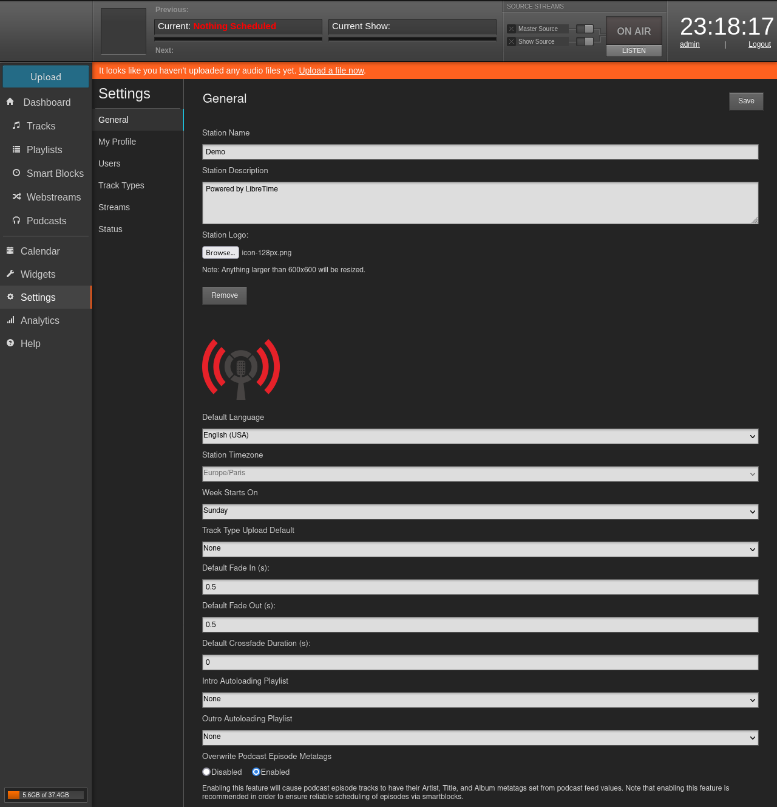

import CodeBlock from "@theme/CodeBlock";

> **Updated 2023.05.26:**
>
> - Use a reverse proxy to simplify the LibreTime nginx configuration upgrade.
> - Fix the Icecast certificates bundle command.

The lack of guides to setup a secure LibreTime server has been a weakness of documentation for a long time now. Users had to search bits and pieces on the Internet, which was probably frustrating. So here is a tutorial that should give a base for anyone that wants to setup a secure LibreTime server.

Note that, I also included the essence of this lengthy post in [the official documentation](https://libretime.org/docs/admin-manual/), make sure to have a look.

{/* truncate */}

This tutorial will walk you through the steps required to install LibreTime from a freshly created server, to a fully working and secure installation.

## Before you start

Before you start, you will need:

- a server running Debian 11 (Bullseye),
- a domain name pointing at the server.

:::note

Most of the command should be usable as-is on Ubuntu 20.04 LTS.

:::

## 1. Preparing the server

Before anything, make sure that the system is up to date:

```bash
sudo apt update
sudo apt upgrade -y
```

### 1.1. Configure the time

In this tutorial we will configure the timezone to `Europe/Paris`, make sure to set your own timezone:

```bash
sudo timedatectl set-timezone Europe/Paris
```

Make sure that the `NTP service` is enabled:

```bash
sudo timedatectl set-ntp true
```

Finally, check that everything was applied by running `timedatectl`:

```bash
sudo timedatectl
```

```
example@libretime:~# sudo timedatectl
               Local time: Mon 2022-12-26 18:47:47 CET
           Universal time: Mon 2022-12-26 17:47:47 UTC
                 RTC time: Mon 2022-12-26 17:47:48
                Time zone: Europe/Paris (CET, +0100)
System clock synchronized: yes
              NTP service: active
          RTC in local TZ: no
```

### 1.2. Configure a firewall

To protect the server, you have to install a firewall that will block any undesired network requests to it.

Run the following command to install the `firewalld` package:

```bash
sudo apt install firewalld
```

By default, `firewalld` will block any incoming request except on some essential ports such as the ssh port. You need to open some ports to allow users to connect to LibreTime (Nginx), Icecast and Liquidsoap:

```bash
# Allow access to Nginx
sudo firewall-cmd --permanent --add-service=http
sudo firewall-cmd --permanent --add-service=https
# Allow access to Icecast
sudo firewall-cmd --permanent --add-port=8000/tcp
sudo firewall-cmd --permanent --add-port=8443/tcp
# Allow access to Liquidsoap input harbor
sudo firewall-cmd --permanent --add-port=8001/tcp
sudo firewall-cmd --permanent --add-port=8002/tcp
# Apply the changes
sudo firewall-cmd --reload
```

Once the changes applied , check your firewall configuration with:

```bash
sudo firewall-cmd --list-all
```

```
example@libretime:~# sudo firewall-cmd --list-all
public
  target: default
  icmp-block-inversion: no
  interfaces:
  sources:
  services: dhcpv6-client http https ssh
  ports: 8000/tcp 8443/tcp 8001/tcp 8002/tcp
  protocols:
  forward: no
  masquerade: no
  forward-ports:
  source-ports:
  icmp-blocks:
  rich rules:
```

## 2. Installing LibreTime

### 2.1. Download LibreTime

Download LibreTime from the command-line:

```bash
wget https://github.com/libretime/libretime/releases/download/3.0.2/libretime-3.0.2.tar.gz
```

And extract the tarball:

```bash
tar -xvf libretime-3.0.2.tar.gz && cd libretime
```

### 2.2. Install LibreTime

To install LibreTime, run the installer and make sure to replace `libretime.example.org` with your own domain name:

```bash
sudo ./install --listen-port 8080 https://libretime.example.org
```

import logs from "raw-loader!./install-logs.txt";

<details>
  <summary>Show the install logs</summary>
  <CodeBlock>{logs}</CodeBlock>
</details>

### 2.3. Configure LibreTime

Before running the steps suggested by the installer, edit the LibreTime configuration file to match your requirements:

```bash
sudo nano /etc/libretime/config.yml
```

Change the configuration file timezone to match the one configured in [1.1. Setup the system time](#11-configure-the-time).

```git title="/etc/libretime/config.yml"
   # The server timezone, should be a lookup key in the IANA time zone database,
   # for example Europe/Berlin.
   # > default is UTC
-  timezone: UTC
+  timezone: Europe/Paris
```

For example, you can change the default stream mount point and enable an extra mp3 stream:

```git title="/etc/libretime/config.yml"
     # Icecast output streams.
     # > max items is 3
     icecast:
       # The default Icecast output stream
       - <<: *default_icecast_output
         enabled: true
         public_url:
-        mount: main
+        mount: main.ogg
         audio:
           format: ogg
           bitrate: 256

       # You can define extra outputs by reusing the default output using a yaml anchor
       - <<: *default_icecast_output
-        enabled: false
-        mount: main-low
+        enabled: true
+        mount: main.mp3
         audio:
-          format: ogg
-          bitrate: 128
+          format: mp3
+          bitrate: 320
```

### 2.4. Start LibreTime

Once LibreTime is configured, run the following command to setup the LibreTime database:

```bash
sudo -u libretime libretime-api migrate
```

```
example@libretime:~# sudo -u libretime libretime-api migrate
Operations to perform:
  Apply all migrations: auth, contenttypes, legacy, sessions
Running migrations:
  Applying contenttypes.0001_initial... OK
  Applying contenttypes.0002_remove_content_type_name... OK
  Applying auth.0001_initial... OK
  Applying auth.0002_alter_permission_name_max_length... OK
  Applying auth.0003_alter_user_email_max_length... OK
  Applying auth.0004_alter_user_username_opts... OK
  Applying auth.0005_alter_user_last_login_null... OK
  Applying auth.0006_require_contenttypes_0002... OK
  Applying auth.0007_alter_validators_add_error_messages... OK
  Applying auth.0008_alter_user_username_max_length... OK
  Applying auth.0009_alter_user_last_name_max_length... OK
  Applying auth.0010_alter_group_name_max_length... OK
  Applying auth.0011_update_proxy_permissions... OK
  Applying auth.0012_alter_user_first_name_max_length... OK
  Applying legacy.0001_initial... OK
  Applying legacy.0003_2_5_2... OK
  Applying legacy.0004_2_5_3... OK
  Applying legacy.0005_2_5_4... OK
  Applying legacy.0006_2_5_5... OK
  Applying legacy.0007_2_5_9... OK
  Applying legacy.0008_2_5_10... OK
  Applying legacy.0009_2_5_11... OK
  Applying legacy.0010_2_5_12... OK
  Applying legacy.0011_2_5_13... OK
  Applying legacy.0012_2_5_14... OK
  Applying legacy.0013_2_5_15... OK
  Applying legacy.0014_2_5_16... OK
  Applying legacy.0015_2_5_17... OK
  Applying legacy.0016_3_0_0_alpha... OK
  Applying legacy.0017_3_0_0_alpha_1... OK
  Applying legacy.0018_3_0_0_alpha_6... OK
  Applying legacy.0019_3_0_0_alpha_7... OK
  Applying legacy.0020_3_0_0_alpha_7_1... OK
  Applying legacy.0021_3_0_0_alpha_7_2... OK
  Applying legacy.0022_3_0_0_alpha_7_3... OK
  Applying legacy.0023_3_0_0_alpha_9_1... OK
  Applying legacy.0024_3_0_0_alpha_9_2... OK
  Applying legacy.0025_3_0_0_alpha_9_3... OK
  Applying legacy.0026_3_0_0_alpha_9_4... OK
  Applying legacy.0027_3_0_0_alpha_13_1... OK
  Applying legacy.0028_3_0_0_alpha_13_2... OK
  Applying legacy.0029_3_0_0_alpha_13_3... OK
  Applying legacy.0030_3_0_0_alpha_13_4... OK
  Applying legacy.0031_3_0_0_alpha_13_5... OK
  Applying legacy.0032_3_0_0_alpha_13_6... OK
  Applying legacy.0033_3_0_0_alpha_13_7... OK
  Applying legacy.0034_3_0_0_alpha_13_8... OK
  Applying legacy.0035_3_0_0_alpha_13_9... OK
  Applying legacy.0036_3_0_0_alpha_13_10... OK
  Applying legacy.0037_move_stream_settings_to_preferences... OK
  Applying legacy.0038_remove_stream_settings_liquidsoap_status... OK
  Applying legacy.0039_remove_stream_settings_stats_status... OK
  Applying legacy.0040_bump_legacy_schema_version... OK
  Applying sessions.0001_initial... OK
```

Next, check that the required services are running:

```bash
# Check that postgresql is running
sudo systemctl status postgresql

# Check that rabbitmq is running
sudo systemctl status rabbitmq-server

# Check that nginx and php-fpm are running
sudo systemctl status nginx php7.4-fpm
```

```txt
example@libretime:~# sudo systemctl status postgresql
● postgresql.service - PostgreSQL RDBMS
     # highlight-start
     Loaded: loaded (/lib/systemd/system/postgresql.service; enabled; vendor preset: enabled)
     Active: active (exited) since Mon 2022-12-26 19:44:44 CET; 1h 54min ago
     # highlight-end
   Main PID: 22428 (code=exited, status=0/SUCCESS)
      Tasks: 0 (limit: 2275)
     Memory: 0B
        CPU: 0
     CGroup: /system.slice/postgresql.service

Dec 26 19:44:44 demo systemd[1]: Starting PostgreSQL RDBMS...
Dec 26 19:44:44 demo systemd[1]: Finished PostgreSQL RDBMS.

example@libretime:~# sudo systemctl status rabbitmq-server
● rabbitmq-server.service - RabbitMQ Messaging Server
     # highlight-start
     Loaded: loaded (/lib/systemd/system/rabbitmq-server.service; enabled; vendor preset: enabled)
     Active: active (running) since Mon 2022-12-26 19:44:59 CET; 1h 55min ago
     # highlight-end
   Main PID: 24281 (beam.smp)
     Status: "Initialized"
      Tasks: 86 (limit: 2275)
     Memory: 87.9M
        CPU: 42.760s
     CGroup: /system.slice/rabbitmq-server.service
             ├─24281 /usr/lib/erlang/erts-11.1.8/bin/beam.smp -W w -K true -A 64 -MBas ageffcbf -MHas ageffcbf -MBlmbcs 512 -MHlmbcs 512 -MMmcs 30 -P 1048576 -t 5000000 -stbt db -zdbbl 128000 -- -root /usr/lib/erlang -progname erl -- -home /var/lib/rabbitmq -- -pa  -noshell -noinp>
             ├─24381 erl_child_setup 65536
             ├─24431 inet_gethost 4
             └─24432 inet_gethost 4

Dec 26 19:44:56 demo systemd[1]: Starting RabbitMQ Messaging Server...
Dec 26 19:44:59 demo systemd[1]: Started RabbitMQ Messaging Server.

example@libretime:~# sudo systemctl status nginx php7.4-fpm
● nginx.service - A high performance web server and a reverse proxy server
     # highlight-start
     Loaded: loaded (/lib/systemd/system/nginx.service; enabled; vendor preset: enabled)
     Active: active (running) since Mon 2022-12-26 19:46:54 CET; 1h 55min ago
     # highlight-end
       Docs: man:nginx(8)
    Process: 43732 ExecStartPre=/usr/sbin/nginx -t -q -g daemon on; master_process on; (code=exited, status=0/SUCCESS)
    Process: 43733 ExecStart=/usr/sbin/nginx -g daemon on; master_process on; (code=exited, status=0/SUCCESS)
   Main PID: 43734 (nginx)
      Tasks: 3 (limit: 2275)
     Memory: 3.3M
        CPU: 21ms
     CGroup: /system.slice/nginx.service
             ├─43734 nginx: master process /usr/sbin/nginx -g daemon on; master_process on;
             ├─43735 nginx: worker process
             └─43736 nginx: worker process

Dec 26 19:46:54 demo systemd[1]: Starting A high performance web server and a reverse proxy server...
Dec 26 19:46:54 demo systemd[1]: Started A high performance web server and a reverse proxy server.

● php7.4-fpm.service - The PHP 7.4 FastCGI Process Manager
     # highlight-start
     Loaded: loaded (/lib/systemd/system/php7.4-fpm.service; enabled; vendor preset: enabled)
     Active: active (running) since Mon 2022-12-26 19:46:54 CET; 1h 55min ago
     # highlight-end
       Docs: man:php-fpm7.4(8)
    Process: 43725 ExecStartPost=/usr/lib/php/php-fpm-socket-helper install /run/php/php-fpm.sock /etc/php/7.4/fpm/pool.d/www.conf 74 (code=exited, status=0/SUCCESS)
   Main PID: 43722 (php-fpm7.4)
     Status: "Processes active: 0, idle: 2, Requests: 4, slow: 0, Traffic: 0req/sec"
      Tasks: 3 (limit: 2275)
     Memory: 14.9M
        CPU: 483ms
     CGroup: /system.slice/php7.4-fpm.service
             ├─43722 php-fpm: master process (/etc/php/7.4/fpm/php-fpm.conf)
             ├─43723 php-fpm: pool www
             └─43724 php-fpm: pool www

Dec 26 19:46:54 demo systemd[1]: php7.4-fpm.service: Succeeded.
Dec 26 19:46:54 demo systemd[1]: Stopped The PHP 7.4 FastCGI Process Manager.
Dec 26 19:46:54 demo systemd[1]: Starting The PHP 7.4 FastCGI Process Manager...
Dec 26 19:46:54 demo systemd[1]: Started The PHP 7.4 FastCGI Process Manager.
```

Finally, start LibreTime and check that it's running:

```bash
# Start LibreTime
sudo systemctl start libretime.target

# Check that LibreTime is running
sudo systemctl --plain | grep libretime
```

```
example@libretime:~# sudo systemctl start libretime.target
example@libretime:~# sudo systemctl --plain | grep libretime
libretime-analyzer.service          loaded active running   LibreTime Media Analyzer Service
libretime-api.service               loaded active running   LibreTime API Service
libretime-liquidsoap.service        loaded active running   LibreTime Liquidsoap Service
libretime-playout.service           loaded active running   LibreTime Playout Service
libretime-worker.service            loaded active running   LibreTime Worker Service
libretime-api.socket                loaded active running   LibreTime API Socket
libretime.target                    loaded active active    LibreTime Services
```

## 3. Securing LibreTime

### 3.1. Install Certbot

The first step to using Let’s Encrypt to obtain an SSL certificate is to install the Certbot software on your server:

```bash
sudo apt install certbot python3-certbot-nginx
```

Let’s Encrypt’s certificates are only valid for ninety days. The Certbot package we installed takes care of this for us by adding a systemd timer that will run twice a day and automatically renew any certificate that’s within thirty days of expiration.

You can query the status of the timer using:

```bash
sudo systemctl status certbot.timer
```

```txt
example@libretime:~/libretime# sudo systemctl status certbot.timer
● certbot.timer - Run certbot twice daily
     # highlight-start
     Loaded: loaded (/lib/systemd/system/certbot.timer; enabled; vendor preset: enabled)
     Active: active (waiting) since Mon 2022-12-26 21:57:01 CET; 21min ago
     # highlight-end
    Trigger: Tue 2022-12-27 08:12:27 CET; 9h left
   Triggers: ● certbot.service

Dec 26 21:57:01 demo systemd[1]: Started Run certbot twice daily.
```

### 3.2. Prepare Nginx for obtaining a certificate

Next, you have to configure a reverse proxy to route the traffic from port `80` to LibreTime (port `8080`).

Copy the following in a new Nginx configuration file, make sure to replace `libretime.example.org` with your own domain name:

```bash
sudo nano /etc/nginx/sites-available/libretime.example.org.conf
```

```nginx title="/etc/nginx/sites-available/libretime.example.org.conf"
server {
  listen 80;
  listen [::]:80;

  server_name libretime.example.org;

  location / {
    proxy_set_header Host              $host;
    proxy_set_header X-Real-IP         $remote_addr;
    proxy_set_header X-Forwarded-For   $proxy_add_x_forwarded_for;
    proxy_set_header X-Forwarded-Proto $scheme;
    proxy_set_header X-Forwarded-Host  $host;
    proxy_set_header X-Forwarded-Port  $server_port;

    proxy_pass http://localhost:8080/;
  }
}
```

Enable the new reverse proxy configuration, make sure to replace `libretime.example.org` with your own domain name:

```bash
sudo ln -s /etc/nginx/sites-{available,enabled}/libretime.example.org.conf
```

Then, check that the nginx config is valid and reload nginx:

```bash
sudo nginx -t

sudo systemctl reload nginx
```

```
example@libretime:~/libretime# sudo nginx -t
nginx: the configuration file /etc/nginx/nginx.conf syntax is ok
nginx: configuration file /etc/nginx/nginx.conf test is successful
example@libretime:~/libretime# sudo systemctl reload nginx.service
```

### 3.3. Obtain a Certificate

Certbot provides a variety of ways to obtain SSL certificates through plugins. The Nginx plugin will take care of reconfiguring Nginx and reloading the config whenever necessary.

To request a Let’s Encrypt certificate using Certbot with the Nginx plugin, run the following:

```bash
sudo certbot --nginx -d libretime.example.org
```

```txt
example@libretime:~/libretime# sudo certbot --nginx -d libretime.example.org
Saving debug log to /var/log/letsencrypt/letsencrypt.log
Plugins selected: Authenticator nginx, Installer nginx
Enter email address (used for urgent renewal and security notices)
# highlight-next-line
 (Enter 'c' to cancel): example@libretime.org

- - - - - - - - - - - - - - - - - - - - - - - - - - - - - - - - - - - - - - - -
Please read the Terms of Service at
https://letsencrypt.org/documents/LE-SA-v1.3-September-21-2022.pdf. You must
agree in order to register with the ACME server. Do you agree?
- - - - - - - - - - - - - - - - - - - - - - - - - - - - - - - - - - - - - - - -
# highlight-next-line
(Y)es/(N)o: y

- - - - - - - - - - - - - - - - - - - - - - - - - - - - - - - - - - - - - - - -
Would you be willing, once your first certificate is successfully issued, to
share your email address with the Electronic Frontier Foundation, a founding
partner of the Let’s Encrypt project and the non-profit organization that
develops Certbot? We'd like to send you email about our work encrypting the web,
EFF news, campaigns, and ways to support digital freedom.
- - - - - - - - - - - - - - - - - - - - - - - - - - - - - - - - - - - - - - - -
# highlight-next-line
(Y)es/(N)o: n
Account registered.
Requesting a certificate for libretime.example.org
Performing the following challenges:
http-01 challenge for libretime.example.org
Waiting for verification...
Cleaning up challenges
# highlight-start
Deploying Certificate to VirtualHost /etc/nginx/sites-enabled/libretime.example.org.conf
Redirecting all traffic on port 80 to ssl in /etc/nginx/sites-enabled/libretime.example.org.conf
# highlight-end

- - - - - - - - - - - - - - - - - - - - - - - - - - - - - - - - - - - - - - - -
Congratulations! You have successfully enabled https://libretime.example.org
- - - - - - - - - - - - - - - - - - - - - - - - - - - - - - - - - - - - - - - -

IMPORTANT NOTES:
 - Congratulations! Your certificate and chain have been saved at:
   /etc/letsencrypt/live/libretime.example.org/fullchain.pem
   Your key file has been saved at:
   /etc/letsencrypt/live/libretime.example.org/privkey.pem
   Your certificate will expire on 2023-03-26. To obtain a new or
   tweaked version of this certificate in the future, simply run
   certbot again with the "certonly" option. To non-interactively
   renew *all* of your certificates, run "certbot renew"
 - If you like Certbot, please consider supporting our work by:

   Donating to ISRG / Let’s Encrypt:   https://letsencrypt.org/donate
   Donating to EFF:                    https://eff.org/donate-le
```

### 3.4 Enable SSL for Icecast

By default, browsers will [prevent loading mixed content](https://developer.mozilla.org/en-US/docs/Web/Security/Mixed_content) on secure pages, so you won't be able to listen the insecure Icecast streams on a secure website. To fix that you need to secure the Icecast streams.

Create a Icecast specific SSL certificate bundle:

```bash
sudo bash -c "install \
  --group=icecast \
  --mode=640 \
  <(cat /etc/letsencrypt/live/libretime.example.org/{fullchain,privkey}.pem) \
  /etc/icecast2/bundle.pem"
```

Enable the secure socket and set the SSL certificate bundle path in the Icecast configuration file:

```bash
sudo nano /etc/icecast2/icecast.xml
```

```git title="/etc/icecast2/icecast.xml"
     <!-- You may have multiple <listen-socket> elements -->
     <listen-socket>
         <port>8000</port>
         <!-- <bind-address>127.0.0.1</bind-address> -->
         <!-- <shoutcast-mount>/stream</shoutcast-mount> -->
     </listen-socket>
     <!--
     <listen-socket>
         <port>8080</port>
     </listen-socket>
     -->
-    <!--
     <listen-socket>
         <port>8443</port>
         <ssl>1</ssl>
     </listen-socket>
-    -->
```

```git title="/etc/icecast2/icecast.xml"
         <!-- Aliases: can also be used for simple redirections as well,
              this example will redirect all requests for http://server:port/ to
              the status page
         -->
         <alias source="/" destination="/status.xsl"/>
         <!-- The certificate file needs to contain both public and private part.
              Both should be PEM encoded.
         <ssl-certificate>/usr/share/icecast2/icecast.pem</ssl-certificate>
         -->
+        <ssl-certificate>/etc/icecast2/bundle.pem</ssl-certificate>
     </paths>
```

Restart Icecast to apply the changes:

```bash
sudo systemctl restart icecast2
```

Next, you need to change the LibreTime `stream.outputs.icecast.*.public_url` configuration to use the newly enabled Icecast secure port:

```bash
sudo nano /etc/libretime/config.yml
```

```git title="/etc/libretime/config.yml"
     # Icecast output streams.
     # > max items is 3
     icecast:
       - <<: *default_icecast_output
         enabled: true
-        public_url:
+        public_url: https://libretime.example.org:8443/main.ogg
         mount: main.ogg
         audio:
           format: ogg
           bitrate: 256

       - <<: *default_icecast_output
         enabled: true
-        public_url:
+        public_url: https://libretime.example.org:8443/main.mp3
         mount: main.mp3
         audio:
           format: mp3
           bitrate: 320
```

Restart LibreTime to apply the changes:

```bash
sudo systemctl restart libretime.target
```

Finally, you need to configure the Certbot renewal to bundle a Icecast specific SSL certificate and restart the Icecast service:

```bash
sudo nano /etc/letsencrypt/renewal/libretime.example.org.conf
```

```git title="/etc/letsencrypt/renewal/libretime.example.org.conf"
 # Options used in the renewal process
 [renewalparams]
 account = d76ce6a241c7c74f79e5443216ee420e
 authenticator = nginx
 installer = nginx
 server = https://acme-v02.api.letsencrypt.org/directory
+
+deploy_hook = 'bash -c "install --group=icecast --mode=640 <(cat $RENEWED_LINEAGE/{fullchain,privkey}.pem) /etc/icecast2/bundle.pem && systemctl restart icecast2"'
```

Check that the renewal configuration is valid:

```bash
sudo certbot renew --dry-run
```

## 4. Tweaking LibreTime

LibreTime should now be accessible at https://libretime.example.org, and you should be able to login with the default username `admin` with the password `admin`.

:::warning

Remember to change your username and password.

:::


### 4.1 Configure the station

To configure the station, go to **Settings** > **General** and fill the desired fields:



## Feedback

I hope this tutorial was helpful, feel free to make a comment [on the forum](https://discourse.libretime.org/t/tutorial-how-to-install-libretime-3-0-2-on-debian-11/1463).
